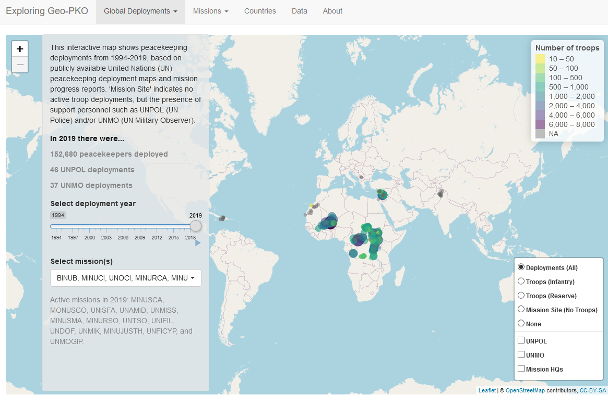

# Geo-PKO-Shiny-Dashboard

Where are peacekeepers deployed? This project uses the Geocoded Peacekeeping Operations (Geo-PKO) dataset to visualize deployment locations and its attributes - troop strength, contributing countries, and troop capabilities. 

 

## Contributors to the project
As research assistants at the Department of Peace and Conflict Research, Uppsala University, [Nguyen Ha](https://github.com/hatnguyen267), [Lou van Roozendaal](https://se.linkedin.com/in/lou-van-roozendaal-bb3052193), and Tanushree Rao ([Twitter](https://twitter.com/@tanushreerao)|[Personal website](https://tanushreerao.com)) built this Shiny dashboard. This GitHub repository contains the code to this application. Since this is an evolving project, we would love to hear if you have any suggestion for improvement, or if you have encountered any issue while using this dashboard.
