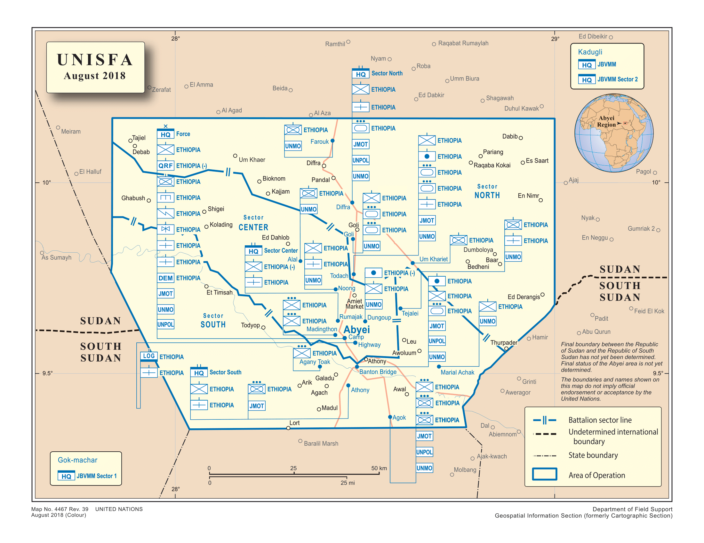
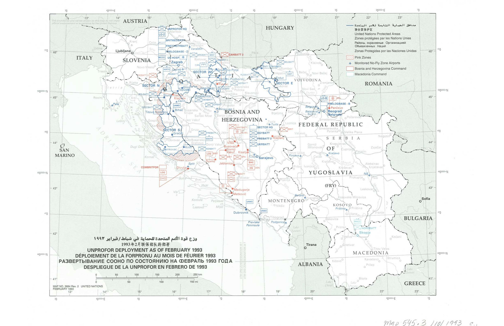

# The Geocoded UN Peacekeeping Operations (Geo-PKO) Dataset
The Geo-PKO dataset provides data on UN peacekeeping deployments. It offers information on key attributes of peacekeeping deployments at the local level, including location, troop size, troop type, headquarters, troop-contributing countries and other variables. Version 2.3 is the latest version of the data, which covers missions taking place globally between 1994 and 2024.
  
### Download the data
[Download v2.3 of the Geo-PKO dataset here.](https://www.uu.se/en/department/peace-and-conflict-research/research/research-data/geo-pko-dataset)  
  
**When using the data (including this website), please cite:**  
Cil, D., Fjelde, H., Hultman, L., & Nilsson, D. (2020). Mapping blue helmets: Introducing the Geocoded Peacekeeping Operations (Geo-PKO) dataset. Journal of Peace Research, 57(2), 360–370.  
  
Data has been coded in accordance with digitally published United Nations peacekeeping deployment maps. For more details on the specific coding rules, limitations, and caveats, please refer to the introduction article above. Troop numbers are based on units identified in each map, in line with standard UN and NATO military unit sizes.
  

    

  
### Work with the data
Since the unit of analysis is deployment location per source map, the data structure may be challenging to work with. Our GitHub documentation provides a guide to working with the Geo-PKO dataset using R. We hope that this will help users produce your own visualizations and incorporate this dataset in your own analysis. 
  
[Explore our documentation on working with Geo-PKO data here.](http://geopko.github.io/Geo-PKO-R)

